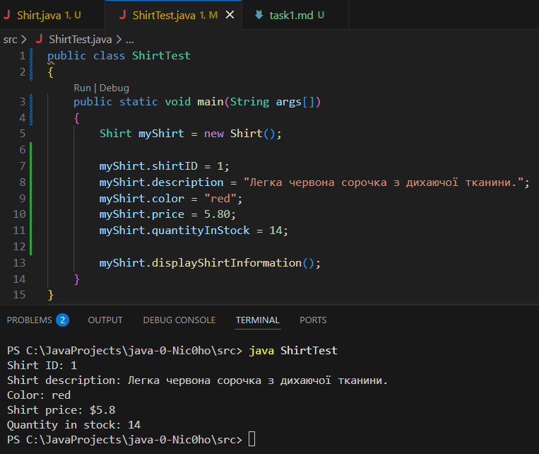

# Виконання завдання 1

## 1 КРОК - клас "Shirt"
### Він зберігає в собі змінні (а також їх значення за замовчуванням) та публічний метод ```"displayShirtInformation()"```, що виводить усю інформацію про сорочку

```java
public class Shirt
{
    public int shirtID = 0;
    public String description = "-description required-";

    public String color = "unset";
    public double price = 0.0;
    public int quantityInStock = 0;

    public void displayShirtInformation()
    {
        System.out.println("Shirt ID: " + shirtID);
        System.out.println("Shirt description: " + description);
        System.out.println("Color: " + color);
        System.out.println("Shirt price: $" + price);
        System.out.println("Quantity in stock: " + quantityInStock);
    }
}
```
## 2 КРОК - створення об'єктів (сорочок)
### В методі ```main()``` класу "ShirtTest" створимо тестовий об'єкт сорочки "myShirt", та подамо в нього вже свої дані
### task1.1 - Перший запуск програми

### Примітка: якщо не вказати свої значення та залишити лише виклик методу ```displayShirtInformation()```, то у консолі ми отримаємо наступне:
```
Shirt ID: 0
Shirt description: -description required-
Color: unset
Shirt price: $0.0
Quantity in stock: 0
```
### Змінимо подані дані на якісь інші:
### task1.2 - Запуск зі зміненими даними
