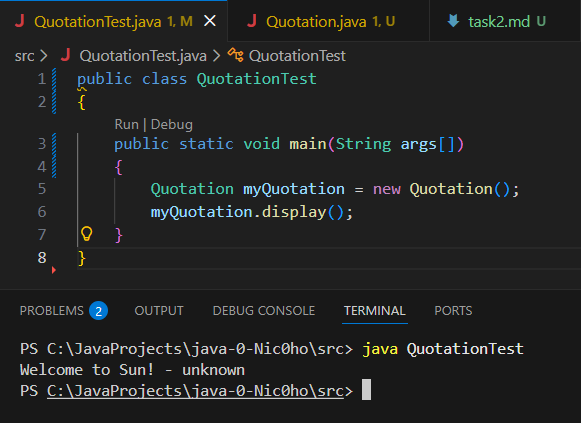
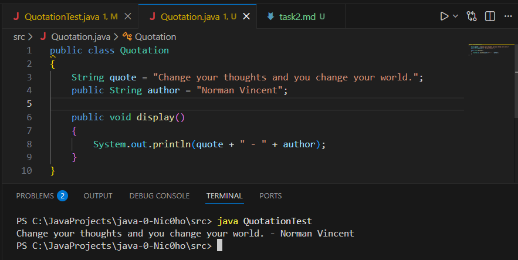

# Виконання завдання 2

## 1 КРОК - клас "Quotation"
### Він збегірає в собі 2 змінні - рядок з цитатою, рядок з її автором (та значення за замовчуванням) та метод ```display()```, що виводить це в красивому вигляді "цитата - автор"

```java
public class Quotation
{
    String quote = "Welcome to Sun!";
    public String author = "unknown";

    public void display()
    {
        System.out.println(quote + " - " + author);
    }
}
```
## 2 КРОК - Вивід цитати та її автора
### У методі ```main()``` QuotationTest.java виклечемо метод ```display()```, та при запуску програми побачимо рядок з нашою цитатою та її автором (поки що, за замовчуванням)
### task2.1 - Перший запуск програми


### У Quotation.java замінимо цитату на довільну
### task2.2 - Запуск програми з довільною цитатою (та її автором)
